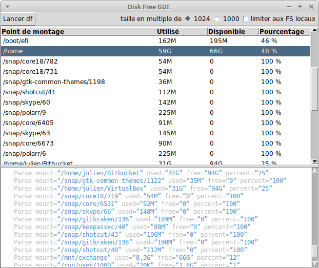

# Statcl df Demo

A thin [Tcl/Tk](https://www.tcl.tk) GUI around the [`df`](http://pubs.opengroup.org/onlinepubs/9699919799/utilities/df.html) POSIX command packaged for Linux as an [AppImage](https://appimage.org) using [Statcl](https://github.com/julien-montmartin/statcl).

[](https://travis-ci.com/julien-montmartin/statcl-df-demo)

Tcl is a great language, especially when it comes to writing a small and efficient GUI with a few lines of code. I personally use it to write tools to ease build processes, or to write a GUI that hides complex and uninteresting command lines. The Tcl code of this repo is not very interesting, and the released AppImage is not very useful (who needs a GUI around `df`?), but it does show how easy it is to build such a tool with [Statcl](https://github.com/julien-montmartin/statcl) and distribute it.

Feel free to go to the [release tab](https://github.com/julien-montmartin/statcl-df-demo/releases/latest) of this repo to download and try the latest AppImage of the df demo. It is built by Travis CI on Ubuntu Trusty (14.04), according to AppImage [recommendations](https://docs.appimage.org/packaging-guide/distribution.html).

<p align="center"></p>

This kind of `sh` script may help you to download the latest release of `dfDemo-x86_64.AppImage` from this repo:

```bash
getStatclDfDemo() {

	curlTxt=https://raw.githubusercontent.com/julien-montmartin/statcl-df-demo/master/curl.txt
	curl -s ${curlTxt} | curl -sLK -
	chmod +x ./dfDemo-x86_64.AppImage
	ls -lh dfDemo-x86_64.AppImage
}
```
